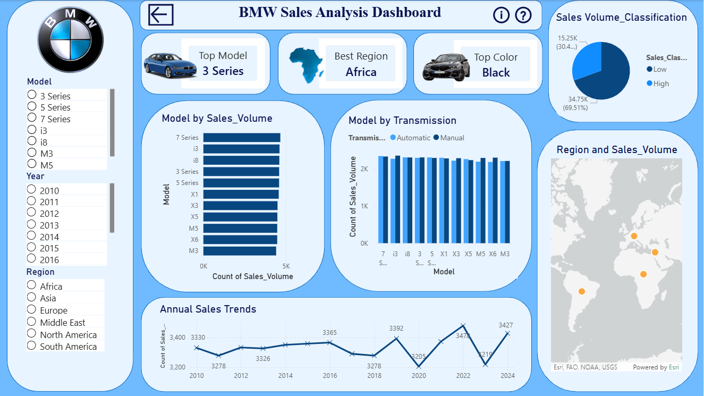

# BMW Sales Analysis Dashboard

## Overview
This Power BI project analyzes BMW sales performance across different models, regions, years, and transmission types. The dashboard provides interactive insights to support data-driven decision-making.

## Dashboard Preview

## Key Features

- Top Selling Model Analysis
- Best Performing Region
- Most Popular Vehicle Color
- Sales Volume Classification
- Model-wise Sales Analysis
- Transmission-wise Comparison
- Annual Sales Trends (2010–2024)
- Regional Sales Distribution
- Interactive Filters (Model, Year, Region)

## Dataset Access

Click the **ℹ️ (Info)** icon within the dashboard to view the dataset and additional project information.

## Tools Used

- Microsoft Power BI
- DAX
- Data Modeling
- Data Cleaning & Transformation
- Data Visualization

## Insights Generated

- Identified top-performing BMW models.
- Compared automatic and manual transmission sales.
- Analyzed annual sales trends.
- Evaluated regional sales performance.

## Author

Pavani Malindi
